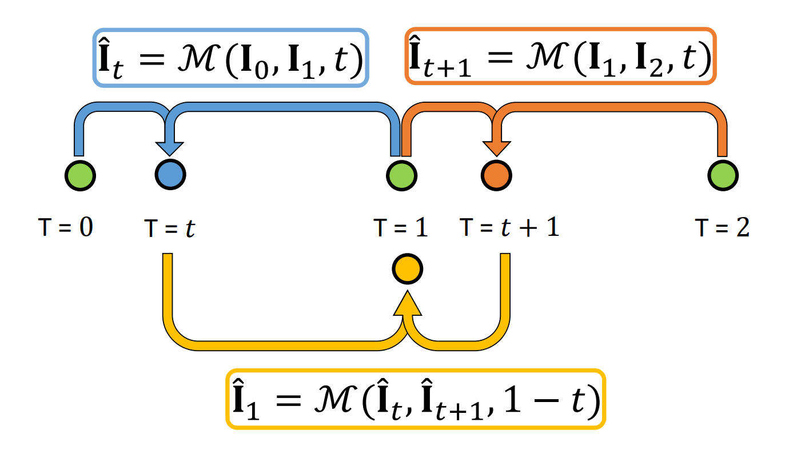
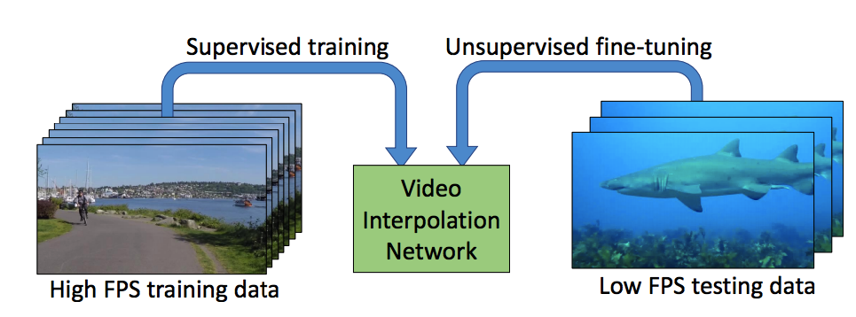
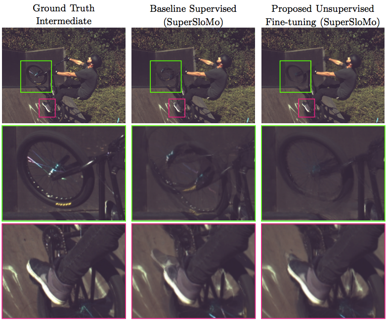
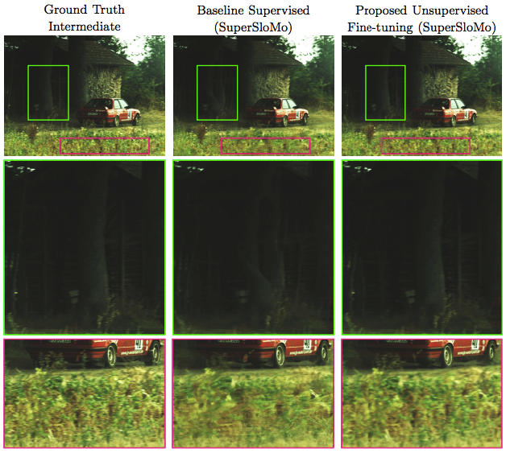

# Unsupervised Video Interpolation using Cycle Consistency
### [Project](https://nv-adlr.github.io/publication/2019-UnsupervisedVideoInterpolation) | [Paper](https://arxiv.org/abs/1906.05928) | [YouTube](https://drive.google.com/uc?export=view&id=1DgF-0r1agSy9Y77Bthm_w135qOABc3Xd)  <br>
[Unsupervised Video Interpolation using Cycle Consistency](https://nv-adlr.github.io/publication/2019-UnsupervisedVideoInterpolation) <br />
[Fitsum A. Reda](https://scholar.google.com/citations?user=quZ_qLYAAAAJ&hl=en), [Deqing Sun](https://scholar.google.com/citations?user=t4rgICIAAAAJ&hl=en)<sup>*</sup>, Aysegul Dundar, Mohammad Shoeybi, [Guilin Liu](https://liuguilin1225.github.io/), Kevin J. Shih, Andrew Tao, [Jan Kautz](http://jankautz.com/), [Bryan Catanzaro](http://catanzaro.name/)  
NVIDIA Corporation <br /> 
In International Conferene on Computer Vision (**ICCV**) 2019. <br />
( * Currently affiliated with Google. ) <br /> 

<p float="left">
  
   
</p
    
## Installation 

    # Get unsupervised video interpolation source codes
    git clone https://github.com/NVIDIA/unsupervised-video-interpolation.git
    cd unsupervised-video-interpolation
    mkdir pretrained_models

    # Build Docker Image
    docker build -t unsupervised-video-interpolation -f Dockerfile .

If you prefer not to use docker, you can manually install the following requirements: 

* An NVIDIA GPU and CUDA 9.0 or higher. Some operations only have gpu implementation.
* PyTorch (>= 1.0)
* Python 3
* numpy
* scikit-image
* imageio
* pillow
* tqdm
* tensorboardX
* natsort
* ffmpeg
* torchvision

To propose a model or change for inclusion, please submit a pull request.

Multiple GPU training and mixed precision training are supported, and the code provides examples for training and inference. For more help, type <br/>
      
    python3 train.py --help


## Network Architectures

Our repo now supports [Super SloMo](https://arxiv.org/abs/1712.00080). Other video interpolation architectures can be integrated with our repo with minimal changes, for instance [DVF](https://arxiv.org/pdf/1702.02463) or [SepConv](https://github.com/sniklaus/sepconv-slomo). 

  
## Pre-trained Models
We've included pre-trained models trained with cycle consistency (CC) alone, or with cycle consistency with Psuedo-supervised (CC + PS) losses. <br />
Download checkpoints to a folder `pretrained_models`. 

Supervised Baseline Weights
- [pretrained_models/baseline_superslomo_adobe.pth](https://drive.google.com/open?id=1BKn9UBpXo6nZRjTOk0ruhjT8gEBpmdoB)(Losses with Paired Ground-Truth )
- [pretrained_models/baseline_superslomo_adobe+youtube.pth](https://drive.google.com/open?id=10MP-NyDTOzQulA1UEGKPHMRL3dgBOey3)(Losses with Paired Ground-Truth )

Unsupervised Finetuned Weights 
- [pretrained_models/unsupervised_random2slowflow.pth](https://drive.google.com/open?id=1F4VDNzSpxGZ0yk-BWj4aCY5sOEknNpKW)(CC only)
- [pretrained_models/unsupervised_adobe2slowflow.pth](https://drive.google.com/open?id=1fHAIxYfNHPYDXrpEWtKMlYhGDYIy91r3)(CC+PS)
- [pretrained_models/unsupervised_adobe+youtube2slowflow.pth](https://drive.google.com/open?id=1NGWNSPk3Pea1sUe6abnTeq-B51WbAsgY)(CC+PS)
- [pretrained_models/unsupervised_random2sintel.pth](https://drive.google.com/open?id=1G04-z62gJPEaXMMwi0LOVk0h-ov3EsVt)(CC only)
- [pretrained_models/unsupervised_adobe2sintel.pth](https://drive.google.com/open?id=17fmGcon07AGGpjF85xDOtMBx6fQV2p4a)(CC+PS)
- [pretrained_models/unsupervised_adobe+youtube2sintel.pth](https://drive.google.com/open?id=1WJg3V0nSshSYMzMEaqMJ_yvwUUm19E-m)(CC+PS)

Fully Unsupervised Weights for UCF101 evaluation
- [pretrained_models/fully_unsupervised_adobe30fps.pth](https://drive.google.com/open?id=1E0OhJzu0zxZunpFK3r7MM8cpS9XhX75-)(CC only)
- [pretrained_models/fully_unsupervised_battlefield30fps.pth](https://drive.google.com/open?id=11bIZA2qMrU-CaZdMSWK50EmJHV9WxVSr)(CC only)

## Data Loaders

We use `VideoInterp` and `CycleVideoInterp` (in [datasets](./datasets)) dataloaders for all frame sequences, i.e. [Adobe](http://www.cs.ubc.ca/labs/imager/tr/2017/DeepVideoDeblurring/), [YouTube](https://research.google.com/youtube8m/), [SlowFlow](http://www.cvlibs.net/projects/slow_flow/), [Sintel](http://www.cvlibs.net/projects/slow_flow/), and [UCF101](http://crcv.ucf.edu/data/UCF101.php). <br />

We split Slowflow dataset into disjoint sets: A low FPS training (3.4K frames) and a high FPS
test (414 frames) subset.
We form the test set by selecting the <b>first</b> nine frames in each of the 46 clips, and train set by temporally sub-sampling
the remaining frames from 240-fps to 30-fps. 
During evaluation, our models take as input the first and ninth frame in
each test clip and interpolate seven intermediate frames. 
We follow a similar procedure for Sintel-1008fps, but interpolate 41 intermediate frames, i.e., conversion of frame rate
from 24- to 1008-fps.
Note, since SlowFlow and Sintel are of high resolution, we downsample all frames by a factor of 2 isotropically. <br />
All training and evaluations presented in the paper are done on the spatially downsampled sequences.

For UCF101, we simply use the the test provided [here](https://people.cs.umass.edu/~hzjiang/projects/superslomo/UCF101_results.zip).

## Generating Interpolated Frames or Videos
- `--write_video` and `--write_images`, if enabled will create an interpolated video and interpolated frame sequences, respectively.
```
#Example creation of interpolated videos, where we interleave low FPS input frames with one or more interpolated intermediate frames.
python3 eval.py --model CycleHJSuperSloMo --num_interp 7 --flow_scale 2 --val_file ${/path/to/input/sequences} \
    --name ${video_name} --save ${/path/to/output/folder} --post_fix ${output_image_tag} \
    --resume ${/path/to/pre-trained/model} --write_video
```
- If input sequences for interpolation do not contain ground-truth intermediate frames, add `--val_sample_rate 0` and `--val_step_size 1` to the example script above.
- For a simple test on two input frames, set `--val_file` to the folder containing both frames, and set `--val_sample_rate 0`, `--val_step_size 1`.

## Images : Results and Comparisons
<p float="left">
  
   
</p
## Videos : Results and Comparisons
<div class="video-fallback">
  <a href="https://drive.google.com/uc?export=view&id=1DgF-0r1agSy9Y77Bthm_w135qOABc3Xd"></a>.
</div>
<div class="video-fallback">
  <a href="https://drive.google.com/uc?export=view&amp;id=1D_dSv8JB0-GHKFkN2YmCIPehoyt7ca4A"></a>.
</div>
<div class="video-fallback">
  <a href="https://drive.google.com/uc?export=view&amp;id=1DeD3oZdT_c3GGz8BOGYpF4rrLWLlB9GU"></a>.
</div>

## Inference for Unsupervised Models
- <b>UCF101</b>: A total of 379 folders, each with three frames, with the middle frame being the ground-truth for a single frame interpolation.
```
# Evaluation of model trained with CC alone on Adobe-30fps dataset
# PSNR: 34.47, SSIM: 0.946, IE: 5.50
python3 eval.py --model CycleHJSuperSloMo --num_interp 1 --flow_scale 1 --val_file /path/to/ucf/root \
    --resume ./pretrained_models/fully_unsupervised_adobe30fps.pth
```
```
# Evaluation of model trained with CC alone on Battlefield-30fps dataset
# PSNR: 34.55, SSIM: 0.947, IE: 5.38
python3 eval.py --model CycleHJSuperSloMo --num_interp 1 --flow_scale 1 --val_file /path/to/ucf/root \
    --resume ./pretrained_models/fully_unsupervised_battlefield30fps.pth
```
- <b>SlowFlow</b>: A total of 46 folders, each with nine frames, with the intermediate nine frames being ground-truths for a 30->240FPS multi-frame interpolation.
```
# Evaluation of model trained with CC alone on SlowFlow-30fps train split
# PSNR: 32.35, SSIM: 0.886, IE: 6.78
python3 eval.py --model CycleHJSuperSloMo --num_interp 7 --flow_scale 2 --val_file /path/to/SlowFlow/val \
    --resume ./pretrained_models/unsupervised_random2slowflow.pth
```
```
# Evaluation of model finetuned with CC+PS losses on SlowFlow-30fps train split.
# Model pre-trained with supervision on Adobe-240fps.
# PSNR: 33.05, SSIM: 0.890, IE: 6.62
python3 eval.py --model CycleHJSuperSloMo --num_interp 7 --flow_scale 2 --val_file /path/to/SlowFlow/val \
    --resume ./pretrained_models/unsupervised_adobe2slowflow.pth
```
```
# Evaluation of model finetuned with CC+PS losses on SlowFlow-30fps train split.
# Model pre-trained with supervision on Adobe+YouTube-240fps.
# PSNR: 33.20, SSIM: 0.891, IE: 6.56
python3 eval.py --model CycleHJSuperSloMo --num_interp 7 --flow_scale 2 --val_file /path/to/SlowFlow/val \
    --resume ./pretrained_models/unsupervised_adobe+youtube2slowflow.pth
```
- <b>Sintel</b>: A total of 13 folders, each with 43 frames, with the intermediate 41 frames being ground-truths for a 30->1008FPS multi-frame interpolation.
```
We simply use the same commands used for SlowFlow, but setting `--num_interp 41`
and the corresponding `--resume *2sintel.pth` pre-trained models should lead to the number we presented in our papers.
```
## Inference for Supervised Baseline Models
- <b>UCF101</b>: A total of 379 folders, each with three frames, with the middle frame being the ground-truth for a single frame interpolation.
```
# Evaluation of model trained with Paird-GT on Adobe-240fps dataset
# PSNR: 34.63, SSIM: 0.946, IE: 5.48
python3 eval.py --model HJSuperSloMo --num_interp 1 --flow_scale 1 --val_file /path/to/ucf/root \
    --resume ./pretrained_models/baseline_superslomo_adobe.pth
```
- <b>SlowFlow</b>: A total of 46 folders, each with nine frames, with the intermediate nine frames being ground-truths for a 30->240FPS multi-frame interpolation.
```
# Evaluation of model trained with paird-GT on Adobe-240fps dataset
# PSNR: 32.84, SSIM: 0.887, IE: 6.67
python3 eval.py --model HJSuperSloMo --num_interp 7 --flow_scale 2 --val_file /path/to/SlowFlow/val \
    --resume ./pretrained_models/baseline_superslomo_adobe.pth
```
```
# Evaluation of model trained with paird-GT on Adobe+YouTube-240fps dataset
# PSNR: 33.13, SSIM: 0.889, IE: 6.63
python3 eval.py --model HJSuperSloMo --num_interp 7 --flow_scale 2 --val_file /path/to/SlowFlow/val \
    --resume ./pretrained_models/baseline_superslomo_adobe+youtube.pth
```
- <b>Sintel</b>: We use commands similar to SlowFlow, but setting `--num_interp 41`.

## Training and Reproducing Our Results
```
# CC alone: Fully unsupervised training on SlowFlow and evaluation on SlowFlow
# SlowFlow/val target PSNR: 32.35, SSIM: 0.886, IE: 6.78
python3 -m torch.distributed.launch --nproc_per_node=16 train.py --model CycleHJSuperSloMo \
    --flow_scale 2.0 --batch_size 2 --crop_size 384 384 --print_freq 1 --dataset CycleVideoInterp \
    --step_size 1 --sample_rate 0 --num_interp 7 --val_num_interp 7 --skip_aug --save_freq 20 --start_epoch 0 \
    --train_file /path/to/SlowFlow/train --val_file SlowFlow/val --name unsupervised_slowflow --save /path/to/output 

# --nproc_per_node=16, we use a total of 16 V100 GPUs over two nodes.
```

```
# CC + PS: Unsupervised fine-tuning on SlowFlow with a baseline model pre-trained on Adobe+YouTube-240fps.
# SlowFlow/val target PSNR: 33.20, SSIM: 0.891, IE: 6.56
python3 -m torch.distributed.launch --nproc_per_node=16 train.py --model CycleHJSuperSloMo \
    --flow_scale 2.0 --batch_size 2 --crop_size 384 384 --print_freq 1 --dataset CycleVideoInterp \
    --step_size 1 --sample_rate 0 --num_interp 7 --val_num_interp 7 --skip_aug --save_freq 20 --start_epoch 0 \
    --train_file /path/to/SlowFlow/train --val_file /path/to/SlowFlow/val --name finetune_slowflow \
    --save /path/to/output --resume ./pretrained_models/baseline_superslomo_adobe+youtube.pth
```

```
# Supervised baseline training on Adobe240-fps and evaluation on SlowFlow
# SlowFlow/val target PSNR: 32.84, SSIM: 0.887, IE: 6.67
python3 -m torch.distributed.launch --nproc_per_node=16 train.py --model HJSuperSloMo \
    --flow_scale 2.0 --batch_size 2 --crop_size 352 352 --print_freq 1 --dataset VideoInterp \
    --num_interp 7 --val_num_interp 7 --skip_aug --save_freq 20 --start_epoch 0 --stride 32 \
    --train_file /path/to/Adobe-240fps/train --val_file /path/to/SlowFlow/val --name supervised_adobe \
    --save /path/to/output
```

## Reference 

If you find this implementation useful in your work, please acknowledge it appropriately and cite the paper or code accordingly:

```
@InProceedings{Reda_2019_ICCV,
author = {Fitsum A Reda and Deqing Sun and Aysegul Dundar and Mohammad Shoeybi and Guilin Liu and Kevin J Shih and Andrew Tao and Jan Kautz and Bryan Catanzaro},
title = {Unsupervised Video Interpolation Using Cycle Consistency},
booktitle = {The IEEE International Conference on Computer Vision (ICCV)},
month = {October},
year = {2019},
url={https://nv-adlr.github.io/publication/2019-UnsupervisedVideoInterpolation}
}
```
We encourage people to contribute to our code base and provide suggestions, point any issues, or solution using merge request, and we hope this repo is useful.  

## Acknowledgments
Parts of the code were inspired by [NVIDIA/flownet2-pytorch](https://github.com/NVIDIA/flownet2-pytorch), [ClementPinard/FlowNetPytorch](https://github.com/ClementPinard/FlowNetPytorch), and [avinashpaliwal/Super-SloMo](https://github.com/avinashpaliwal/Super-SloMo).

We would also like to thank Huaizu Jiang.

## Coding style
* 4 spaces for indentation rather than tabs
* 80 character line length
* PEP8 formatting
